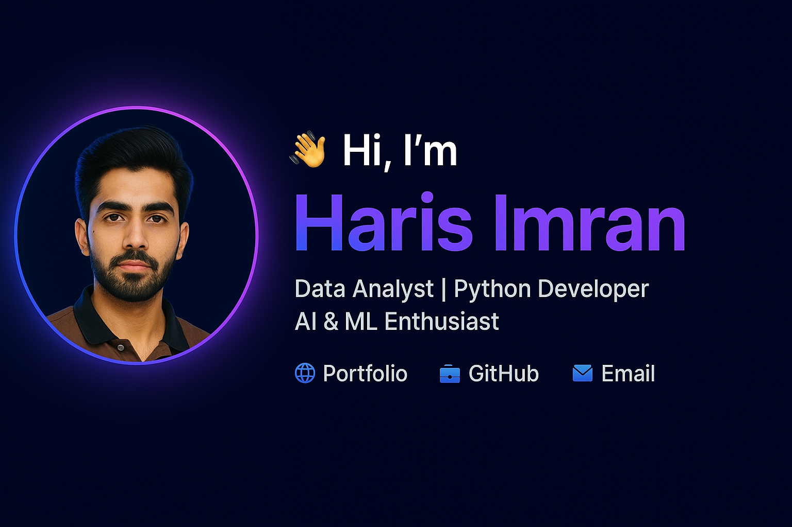

<!-- Banner Section -->

  

<h1 align="center">👋 Hi, I'm Haris Imran</h1>
<h3 align="center">Data Analyst | Python Developer | AI & ML Enthusiast</h3>

  <a href="https://harischughtai.github.io">🌐 Portfolio</a> •
  <a href="https://github.com/harischughtai">💼 GitHub</a> •
  <a href="mailto:imranharis790@gmail.com">📩 Email</a>

---

# 🧑‍💻 About Me  

Highly motivated and detail-oriented **Data Analyst & Data Scientist** with hands-on experience in  
data wrangling, visualization, predictive modeling, and AI-driven healthcare solutions.  

I love converting raw, messy data into **actionable insights**, automated pipelines, and intelligent ML models.

---

# ⚡ Tech Stack & Skills

### **Programming**

  

### **Data Analytics**

  
  
  

### **Python Libraries**

  
  
  
  

### **Machine Learning / AI**

  
  

### **Tools**

  

---

# 📂 Featured Projects

### 🔹 **AI-Driven ROP Detection System (Final Year Project)**
- Multi-model deep learning pipeline for screening **Retinopathy of Prematurity**  
- CNN-based classification  
- 2800+ medical images preprocessing  
- Streamlit dashboard for doctors  

---

# 📄 Download My CV  

  

---

# 📊 GitHub Stats

  
  

---

# 🤝 Connect With Me  

  
  

---

⭐ **If you like my work, consider giving a star to my repositories!**
